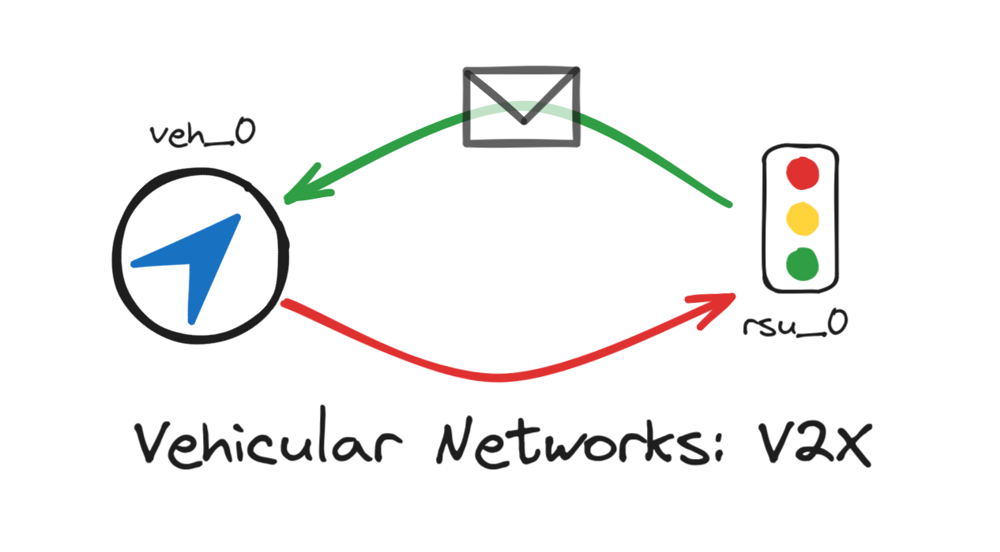

# Intelligent Traffic Light System

Practical Project - New Network Paradigms - Group 13

## Overview

This project involves the implementation of an intelligent traffic light system supported by vehicular communications (V2X), without the use of physical traffic lights. The implementation leverages technologies taught in the New Network Paradigms course of the Master's in Computer Engineering at the University of Minho, using Eclipse Mosaic and SUMO for road network simulations.

### Scenario Used

The scenario used, called "Fifth Avenue," represents the intersection of "East 16th Street" and "5th Avenue" in New York City. This scenario allows testing of the applications developed for vehicles and communication units, as well as visualization of traffic flow and interactions with network elements.

### System Architecture

#### Road-side Unit (RSU)
- Receives and processes messages from vehicles equipped with communication units (On-board Units).
- Types of messages:
  - **Detection Messages:** Detect vehicles within the area of reach.
  - **State Messages:** Transmit the state of the virtual traffic light to the vehicles.
  - **Control Messages:** Control vehicles on a specific route and lane.

#### Vehicles and On-board Units (OBU)
- Send and receive messages like the RSUs.
- Use **Cooperative Awareness Messages (CAM)** to inform the neighborhood about their position and status.

### Communication

#### Cooperative Awareness Messages
- Inter-vehicle messages broadcasted every 500ms.
- Help in the constant update of the vehicles' neighborhood table.

#### State Messages
- Inform vehicles in the detection area about the state of the virtual traffic light.
- Possible states: GREEN, RED, YELLOW, BLINKING.

#### Detection Messages
- Transmitted between vehicles and RSU when the vehicle is in the detection area but out of RSU range.
- Use **Topological Unicast** to reach the RSU.

#### Control Messages
- Control actions of vehicles (STOP, GO, SLOW_DOWN) on a specific route.
- Transmitted by unicast and retransmitted by vehicles.


## Demo

[](https://www.youtube.com/watch?v=OY2H8n9o-L0)


## Run Locally

The script located in the base directory links the scenario and compiles the applications used:

```bash
$ ./compile.sh (path/to/mosaic)
```


## Authors

- [@Guilherme Sampaio](https://github.com/gweebg)
- [@Miguel Gomes](https://github.com/MayorX500)
- [@Rodrigo Pereira](https://github.com/eivarin)


## License

[MIT](https://choosealicense.com/licenses/mit/)

